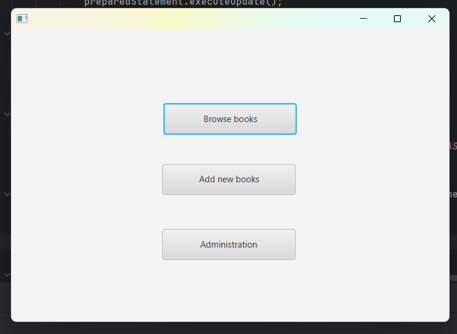

Project Overview:

Technology Stack: javafx for UI, Spring boot but not well used for backend logic and Mysql data managment

Classes and Functions: 	User : Users - defining database users
				    UserDat - Methods and Queries for operations in users, to work in datbase
			Book : Book - defing dtabase books
				    BooksDat - Methods and Queries for operations in book, to work in databse

			Another files in Book and User directory have no use but I left them in for myself. It was because I wanted to do 			it better but my time managment on this project wasnt enough.
			
			Application fuctions: javaFX application classes and methods that are creating application fuctions:
			ChartController
			SceneController
			SceneController2
			RegistrationController
			BrowseController
			AdministrationController
			DomeApllication that is running the whole application

			fxml files that are creating UI

User interface: I am using javaFX as user interface. In total there is 7 scenes in my application(for log in, sing up, for administrator and user role, and for the independent actions: browse a book, add new book and administrations)
The logic of my UI is shown on pictures:

choose between sing up and log in

Log in: select correct username and password, Sing up: select none existing username

Menu for administrator to choose between actions, user has no administration action

Browse a book: you can find book you want and buy it if there is an available copy, the bought book is added to the transaction database.
If the book doesnt exist the text field informs you about it. It also infroms you when you bought the book succesfully. The available copies are decreased by 1.

Add a book the the available books to find and buy.

Administration: you can make user an administrator or you can delete user from the system

Database design: For now I have 3 databases, for books and for users and for transactions, the database for roles doesnt have impact in my application so I dindt used it. The structure of columns in these databases are as in the semestrial work presentation.

Chalanges and approach: I tried to connect to the database via spring boot it worked but my queries didnt. I dindt reserved the time that was needed to fix this so I am connecting to databases separately. That was probably the biggest chalange to connect javaFX with databases via spring boot. 
